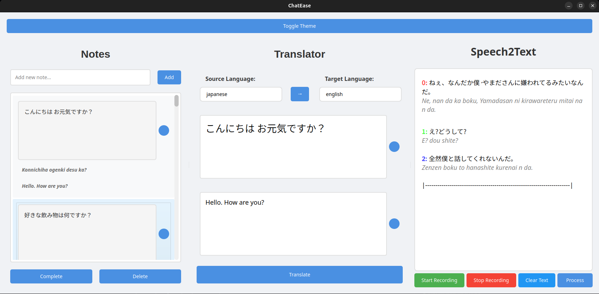

# ChatEase

This project is a PyQt5 application that allows users to **practice**, **take notes**, and **convert speech to text**. The application consists of three main components:

- **Notes**: Allows users to take notes, **(I am taking notes of the questions i will use for speaking practice.)**
  
- **Translator**: Enables users to translate text between different languages.
  
- **Speech-to-Text**: Converts what the other person says into **text**


## Features

- **Notes**: Take notes **(automatic romaji for Japanese notes)**
  
- **Translation**: Translate text between two languages. **(deep-translator library)** **(i removed helsinki-nlp)**
  
- **Speech Recognition**: Convert spoken words into text.


## Technologies

- Python3.12.3
- PyQt 5 (GUI)
- PyTorch
- Speech to Text (Whisper OpenAI)
- deep-translator (Google Translate API)
- Language recognition (langdetect)
- Japanese to romaji conversion (Cutlet)
- Sound card access (soundcard)
- Audio file processing (soundfile)
- Audio signal processing (audioop)
- Text-to-speech synthesis (gTTS- Google Text to Speech)


## Screenshots
 


## Setup

### Tested Environment
- Ubuntu 24.04

- Python 3.12.3
  
- PyTorch (https://pytorch.org/get-started/locally/) **tested with 2.5.1**


## Linux Setup
```bash
# Clone the repository
git clone https://github.com/MRamazan/ChatEase
cd ChatEase

# Create a virtual environment
python3 -m venv venv
source venv/bin/activate

# Install PyTorch – Use GPU version for better performance if you have cuda or rocm installed
# Install pytorch from (https://pytorch.org/get-started/locally)

# Install other dependencies
pip install -r requirements.txt


# Run the app
python3 interface.py
```

## Windows Setup
```bash
# Clone the repository
git clone https://github.com/MRamazan/ChatEase
cd ChatEase

# Create a virtual environment
python -m venv venv

# Activate the virtual environment
venv\Scripts\activate

# Install PyTorch – Use GPU version for better performance if you have cuda or rocm installed
# Install pytorch from (https://pytorch.org/get-started/locally)

# Install other dependencies
pip install -r requirements.txt

# Run the app
python interface.py
```
