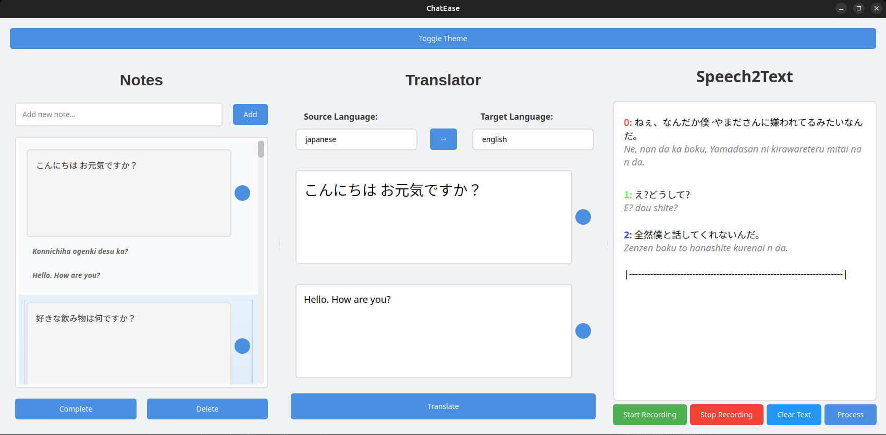

# ChatEase

This project is a PyQt5 application that allows users to **practice**, **take notes**, and **convert speech to text**. The application consists of three main components:

- **Notes**: Allows users to take notes, **(I am taking notes of the questions i will use for speaking practice.)**
  
- **Translator**: Enables users to translate text between different languages.
  
- **Speech-to-Text**: Converts what the other person says into **text**


## Features

- **Notes**: Take notes **(automatic romaji for Japanese notes)**
  
- **Translation**: Translate text between two languages. **(It uses Helsinki-NLP for EN-JA JA-EN translate, google translate for other langauges)**
  
- **Speech Recognition**: Convert spoken words into text.


## Screenshots
 


## Setup

### Requirements
- Python 3.
  
- PyTorch (https://pytorch.org/get-started/locally/)


```bash
git clone https://github.com/MRamazan/ChatEase
cd ChatEase

python3 -m venv venv
source venv/bin/activate
pip install -r requirements.txt

python3 interface.py
